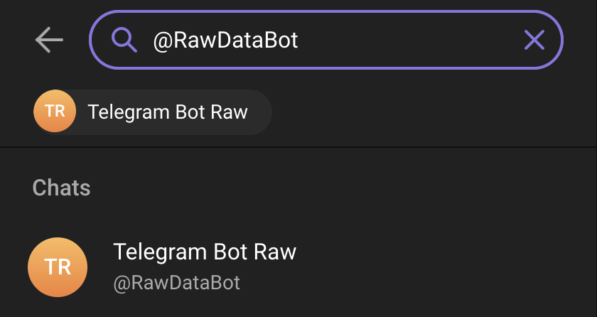
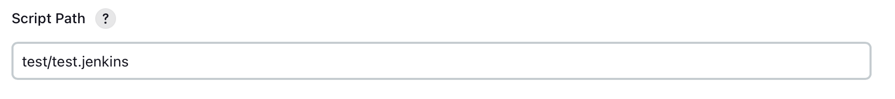

# JenTel-Notify

### Info:

Hello, my name is Anton and this is my project for making notification of Jenkins's status pipeline easier.

### Requirements:

1. **Jenkins** on any machines whatever you prefer
   (make sure that your Jenkins works well with the help of creating a Freestyle project, for example)
2. **Telegram bot**

## Start:

#### First let's create a Telegram bot:

Info: we do this because we need to get ***token_id*** and ***chat_id*** for our pipeline. In order to make it secured we will use Jenkins's credentials.

1. Open Telgram and type in the search field the exact write "@BotFather"

    Click on the first one with id**@BotFather**

2. Type "/start" and "/newbot" then folow the bot instructions untile the message like in the screenshoot below

   

   **Congratulations!** we have created a bot and also know the token of it. It will be usefull for us a little bit later.

   
3. Now let's find out the chat_id and turn back to the search field writing @RawDataBot like in the screenshoot below

   
4. Click on the bot and click on the button "/start" and then we will see information about us. Take the special field -> "chat" -> "id".

   
5. Great! Now we know our id that we'll be used a little bit later.

#### Jenkins credentials:

   Now we should create credentials for Jenkins with this way
   ***Dashboard -> Manage Jenkins -> Credentials -> System -> Global credentials (unrestricted)***

   
6. Click on the button ***'+ Add Credentials'.***

   
7. Now we have to create 2 credentials with id ***"chat_id"*** and ***"bot_id"***.

* Create "***bot_id"*** credential taking token id in the red rectangle and put it the ***Secret*** field:
  

  
* Create new "***chat_id"*** credential taking token id in the red rectangle and put it the ***Secret*** field:
  

  

8. The final result like in the screenshoot below:

   

#### Connecting Python script into Jenkins pipeline

I assume that you already have a ready-made pipeline, but in any case, for now we can use the test one ([your_repo]/test/test.jenkins).

1. The configuration of this project is:

   

   
2. Let's take a look at the example below:

4. Our main part is like in the screenshoot below:

   

   What we have here:

   1. Credential 'chat_id' with variable 'CHAT_ID'.
   2. Credential 'bot_id' with variable 'BOT_ID'
